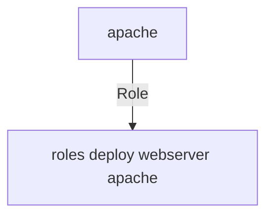

<!-- DOCSIBLE START -->

# 📃 Role overview

## deploy_webserver_apache


Description: Role para configurar e validar Apache com firewall


| Field                | Value           |
|--------------------- |-----------------|
| Readme update        | 05/06/2025 |


### Vars

**These are variables with higher priority**
#### File: vars/main.yml

| Var          | Type         | Value       |
|--------------|--------------|-------------|
| [apache_test_message](vars/main.yml#L3)   | str | `Test apache e automation` |    


### Tasks


#### File: tasks/main.yml

| Name | Module | Has Conditions |
| ---- | ------ | -------------- |
| latest Apache version installed | yum | False |
| latest firewalld version installed | yum | False |
| firewalld enabled and running | service | False |
| firewalld permits http service | firewalld | False |
| Ensure proper Apache configuration | copy | False |
| Ensure proper Apache configuration | copy | False |
| deploy index.html | template | False |
| Apache enabled and running | service | False |
| Test page link | uri | False |
| Display result | debug | False |
| Fail if return code is not 200 | fail | True |
| Access page | debug | False |


## Task Flow Graphs


### Graph for main.yml

```mermaid
flowchart TD
Start
classDef block stroke:#3498db,stroke-width:2px;
classDef task stroke:#4b76bb,stroke-width:2px;
classDef includeTasks stroke:#16a085,stroke-width:2px;
classDef importTasks stroke:#34495e,stroke-width:2px;
classDef includeRole stroke:#2980b9,stroke-width:2px;
classDef importRole stroke:#699ba7,stroke-width:2px;
classDef includeVars stroke:#8e44ad,stroke-width:2px;
classDef rescue stroke:#665352,stroke-width:2px;

  Start-->|Task| latest_Apache_version_installed0[latest apache version installed]:::task
  latest_Apache_version_installed0-->|Task| latest_firewalld_version_installed1[latest firewalld version installed]:::task
  latest_firewalld_version_installed1-->|Task| firewalld_enabled_and_running2[firewalld enabled and running]:::task
  firewalld_enabled_and_running2-->|Task| firewalld_permits_http_service3[firewalld permits http service]:::task
  firewalld_permits_http_service3-->|Task| Ensure_proper_Apache_configuration4[ensure proper apache configuration]:::task
  Ensure_proper_Apache_configuration4-->|Task| Ensure_proper_Apache_configuration5[ensure proper apache configuration]:::task
  Ensure_proper_Apache_configuration5-->|Task| deploy_index_html6[deploy index html]:::task
  deploy_index_html6-->|Task| Apache_enabled_and_running7[apache enabled and running]:::task
  Apache_enabled_and_running7-->|Task| Test_page_link8[test page link]:::task
  Test_page_link8-->|Task| Display_result9[display result]:::task
  Display_result9-->|Task| Fail_if_return_code_is_not_20010[fail if return code is not 200<br>When: **result status    200**]:::task
  Fail_if_return_code_is_not_20010-->|Task| Access_page11[access page]:::task
  Access_page11-->End
```




## Playbook

```yml
---
- name: Deploy webserver apache
  hosts: apache
  gather_facts: true
  roles:
    - role: ../roles/deploy_webserver_apache
```
## Playbook graph


## Author Information
Allan Roque

#### License

MIT

#### Minimum Ansible Version

2.9

#### Platforms

- **EL**: [8, 9]


#### Dependencies

No dependencies specified.
<!-- DOCSIBLE END -->
